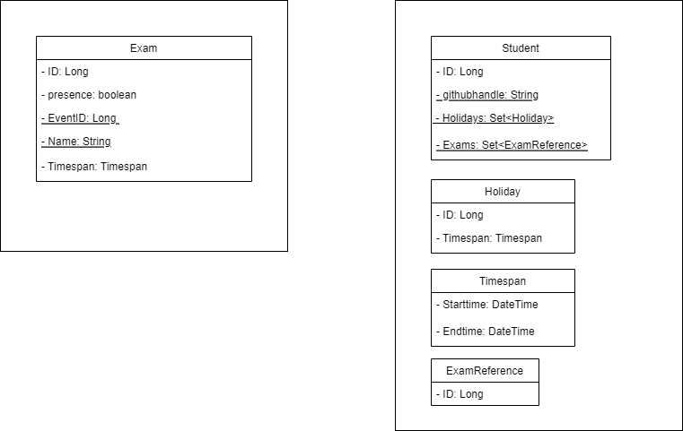

== 1. Einführung und Ziele

=== 1.1 Aufgabenstellung

.Was ist chicken?
****
- Chicken ist ein Informationssystem zur Verwaltung von Urlaub und Klausuren für Studenten
während eines Praktikums.
- Die Entwicklung von Chicken dient der Bewertung des Lernfortschritts und dem erzielen der
Klausurzulassung einer Gruppe von Studenten innerhalb des Moduls Propra2
****

.Wesentliche Features
****
- Implementierung von diversen Regeln zur Buchung von Urlaub
- Bereitstellung von drei Rollen (siehe unten)
- Grafische Bedienungsoberfläche im Webbrowser

****

****
[cols="1,2,2"]
.Rollen innerhalb des Systems
|===

|Rolle
|Aufgabe im System
|Aktionen

|Admin
|Administrator des Systems
|nicht implementiert

|Leader
|Tutoren der Veranstaltung
|nicht implementiert

|Studenten
|StandardUser
|kann Urlaub und Klausuren buchen

|===
****

=== 1.2 Qualitätsziele

****

[cols="1,4"]
.Qualitätsanforderungen
|===

|Qualitätsziel
|Motivation und Erläuterung

|Accessiblility
|Chicken soll für so viele Studenten wie möglich nutzbar sein, daher werden
mögliche Barrieren aus dem Weg geschafft (Screenreaderfreundlich, keine Sprachbarrieren)

|Wartbarkeit
|Um die Software in Zukunft Platformunabhängig zu halten und leicht erweitern zu können, werden entsprechende Technologien und
Entwicklungspraktiken genutzt

|Funktionale Korrektheit
|deterministische Funktionsweise des Systems, um eine hohe Nutzbarkeit zu gewährleisten

|Nutzerfreundlichkeit
|intuitive Bedienung der Anwendung, Fehlermeldungen

|===

****

=== 1.3 Stakeholder

****

[cols="1,3"]
.Interessenten am System
|===

|Stakeholder
|Interesse, Bezug

|Lehrende Personen der Veranstaltung Propra2
|Bewertung der Software mit Blick auf die in der Veranstaltung Propra2 vorgestellten
Entwicklungspraktiken und Konzepte

|Entwickler
|Lernerfoleg durch vollständige Entwicklung eines Informationssystems im Team
inkl. Softwarearchitektur

|Studenten
|einfaches anmelden von Urlaub und Klausuren um Abwesenheit vom Praktikum
einzutragen

|===

****

== 2.Randbedingungen

=== 2.1 Technische Randbedingungen

*****

[cols="2,3"]
.Technische Randbedingungen
|===

|Randbedingung
|Erläuterung, Hintergrund

|Implementierung in Java
|Platformunabhängigkeit, Vorgabe im Praktikum

|Grafische Bedienoberfläche in HTML
|Platformunabhängigkeit

|Geringe Abhängigkeit von Fremdsoftware
|Auslagerung von Security um höhere Sicherheit zu gewährleisten

|===

*****

=== 2.2 Organistatorische Randbedingungen

****

[cols="1,3"]
.Organisatorische Randbedingungen
|===

|Randbedingungen
|Erläuterung, Hintergrund

|Team
|Tiemo Timtschenko, Timo Bolte, Niels Reck, Jann Tschierschke

|Zeitplan
|07.03.2022 bis 25.03.2022

|Vorgehensmodell
|Entwicklung nach den Regeln des mob-programmings https://github.com/remotemobprogramming/mob

|Entwicklungswerkzeuge
|Entwicklung mit IntelliJ IDEA, Build durch Gradle

|===

****

== 3.Kontextabgrenzung

=== 3.1 Fachlicher Kontext

****

[cols="1,2,2"]
|===

|Kommunikationsbeziehung
|Eingabe
|Ausgabe

|Student - System
|Angabe von Personenspezifischen Urlaubszeiten und Klausuren
|aktuelle Urlaube und Klausuren, buchung von Urlauben und Klausuren

|Admin - System
|keine Funktionalität (Pfad dennoch vorhanden)
|keine Funktionalität (Pfad dennoch vorhanden)

|Leader -System
|keine Funktionalität (Pfad dennoch vorhanden)
|keine Funktionalität (Pfad dennoch vorhanden)

|System - GitHub (per OAuth)
|redirect zu Github Auth, Client-id, Client-Secret
|GitHub-User (handle)

|===

****

=== 3.2 Technischer Kontext

****
- GitHub (Fremdsystem)

Authentifizierung über Github
****

== 5. Bausteinsicht

=== 5.1 Subprojekte

****

Chicken zerfällt in 5 Subprojekte, die jeweils ihre eigenen Fachbereiche implementieren und Schnittstellen
unter sich aufweisen und sich nach dem Onion-Architekturmodell richten. (Qualitätsziel Wartbarkeit)

.Subprojekte
[cols="1,4"]
|===

|Subprojekt
|Fachbereich/Aufgabe

|chicken_adapter_db
|Schnittstelle zur Datenbank, Datenübertragung per dto's

|chicken_adapter_web
|Schnittstelle zum Frontend, Daten zum verarbeiten vom Nutzer entgegennehmen und wieder ausliefern

|chicken_application
|Orchestrierung von Geschäftfällen, nötige aggregate laden/erzeugen, Geschäftslogik aufrufen

|chicken_domain
|Bildet die Domäne ab, implementierung von Geschäftlogik

|chicken_spring
|Infrastrukturlayer

|===

****

== 6. Laufzeitsicht

=== 6.1 Laufzeitszenario

****
- Student

Nach der Authentifizierung landet der Nutzer auf der Homepage. Dort kann er
gebuchten Urlaub und gebuchte Klausuren, sowie verbeliebende und bereits gebuchte Urlaubszeit
einsehen und Urlaube und Klausuren bis zum Vortag stornieren.
Desweiteren kann von dort aus per Button auf Seiten zur Urlaubs- und Klausurbuchung weitergegangen werden.

Auf der Seite zur Urlaubsbuchung werden die Urlaubsdaten per FormObjekt (HolidayForm)
an das Backend übergeben, wobei schon per Annotation "@NotNull" geprüft wird, ob leere Felder abgeschickt werden.
Weitere Validierung in Bezug auf die Regeln der Urlaubsbuchung passieren im Backend.
Bei validem Urlaub wird dieser in der Datenbank abgespeichert und der Nutzer auf die Homepage weitergeleitet, auf welcher
dieser nun auch angezeigt wird.

Die Klausurbuchung verläuft recht Analog zur Urlaubsbuchung. Nachdem der Nutzer von der Homepage zur
Klausurbuchung weitergeleitet wurde, kann er existierende Klausuren Auswählen, und wird zurück auf die Homepage
gebracht. Ist eine Klausur noch nicht vorhanden, so kann der Nutzer eine neue anlegen.
Hier übergibt der Nutzer die Klausurdaten, woraufhin ein WebCrawler checkt, ob eine entsprechende EventId mit dem richtigen
Veranstaltungsnamen existiert.
Ist dies nicht der Fall, wird der Nutzer aufgefordert, eine gültige EventId einzugeben.
Existiert entsprechende Veranstaltung, so wird sie der Datenbank hinzugefügt und der Nutzer hat die möglichkeit sich direkt zu
der Klausur anzumelden.
Im Anschluss wird der Nutzer auf die Homepage weitergeleitet.

****

****

- Admin

Ist der User im System als Admin eingetragen, wird er auf eine dedizierte Homepage weitergeleitet, auf
der keine Funktionalität existiert.

****

****

- Leader

Ister der User im System als Leader eingetragen, wird er auf eine dedizierte Homepage weitergeleitet,
auf der keine Funktionalität existiert.

****

== 7. Verteilungssicht

=== 7.1 Infrastruktur

****

- Frontend wird per HTML mit thymeleaf an den Nutzer ausgeliefert.

- Backend läuft mit Java mit Spring

****

****

Softwarevoraussetzungen beim Nutzer:

- funktionierender Browser

****

== 8. Querschnittliche Konzepte

=== 8.1 DomänenModell

.Chicken-DomänenModell
****

****

=== 8.2 Benutzeroberfläche

****

Chicken besitzt eine grafische Benutzeroberfläche, welche intuitiv bedienbar ist und
eine hohe Nutzbarkeit auch für eingeschränkte Nutzer der Anwendung aufweist.
(Qualitätsziel Accessibility)

****

=== 8.3 Validierung

****

Damit nicht willkürlich Urlaub und Klausuren gebucht weden können, sind folgende Regeln implementiert:

*****

Urlaub

Anmeldung

- Urlaub nur an Praktikums-Tagen
- im Praktikums-Zeitraum
- Das Datum ist vor dem ersten Praktikumstag am 07.03.2022
- Das Datum ist nach dem letzten Praktikumstag am 25.03.2022
- nicht am Wochenende/Feiertagen
- Das Datum liegt am Wochenende
- Praktikums-Tage und Zeiten setzen (Config)
- Urlaub nur während Praktikums-Zeit
- ggf. auch setzen
- Die früheste erlaubte Startzeit für Sie ist 09:30
- Die späteste erlaubte Endzeit für Sie ist 13:30
- Startzeit muss vor Endzeit sein
- nur bestimmte Zeitblöcke
- Es sind nur ganze Viertelstunden (d.h. 00, 15, 30 und 45) erlaubt.
- Urlaub ist nicht doppelt-buchbar
- maximale Urlaubszeit nicht überschreiten
- ggf. setzen
- Urlaubszeiten überschreiben, falls Überschneidung
- ggf. Bestätigung
- Nachträglichen Urlaub setzen soll nicht möglich sein
- höchstens 2,5 Stunden, sonst 4 Stunden Urlaub
- zwei Blöcke an einem Tag möglich
- müssen an Anfang und an Ende liegen
- Bei zwei Urlaubsblöcken an einem Tag muss der erste Block am Anfang des Praktikums liegen.
- Bei zwei Urlaubsblöcken an einem Tag muss der zweite Block am Ende des Praktikums liegen.
- min. 90 Arbeitszeit dazwischen
- nur an einem Tag buchbar
- wenn Klausur am selben Tag, dann Urlaub beliebig wählbar
- wenn Urlaub während Klausur gebucht wird
- Meldung
- Urlaub automatisch verkürzt
- Urlaub nicht am gleichen Tag oder in der Vergangenheit buchbar
- Idee: PastOrPresent Validation Annotation im Controller

Stornierung

- Urlaubstag stornierbar bis Vortag
- Bei Stornierung der Klausur:
- Urlaub an dem Tag wird gelöscht
- Meldung, dass Urlaub auch gelöscht wird

Klausuren

Anmeldung

- Präsenz-Klausur vor und nach Klausurzeit zusätzlich 2 Stunden freigestellt
- Online-Klausur vor Klausurzeit zusätzlich 30 Minuten freigestellt
- wenn Klausur-Anmeldung überschnitten mit Urlaub
- Meldung
- Urlaub automatisch angepasst

Eintragung

- (nur während Praktikumszeiten)
- richtige Klausurzeiten sollen möglich sein
- bei Urlaubsbuchung soll entsprechend
- evtl. prüfen, ob Veranstaltungs-ID zum Kursnamen passt

Stornierung

- Klausurtermin stornierbar bis Vortag

*****

****

=== 8.4 Testbarkeit

Die Funktionalität der einzelnen von Chicken wird durch Unit-Tests sichergestellt. Diese sind im
Verzeichnis immer parallel zur Ordnerstruktur des Anwendungscodes unter src/test in den einzelnen
Subprojekten zu finden.

== 9. Architekturentscheidungen

=== 9.1 Onion-Architektur

****

Es wurde eine Onion-Architektur verwendet, da diese vorgegeben wurde.

****

=== 9.2 Gradle Subprojekte

****

Es wurden Gradle Subprojekte verwendet, um eine strikte Trennung der Schichten und Einhaltung des
Onion-Architekturmodells zu erreichen. (siehe 5.1 Subprojekte)

****
